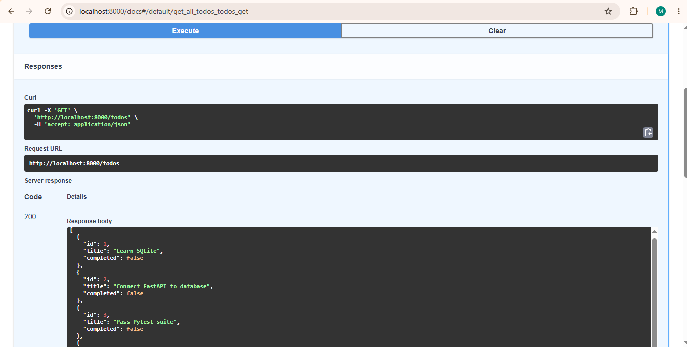

# FastAPI SQLite To-Do API

An interactive To-Do List API built with FastAPI and SQLite. It supports full CRUD operations, persistent database storage, and automated testing.

## Overview

* **FastAPI**: Manages API routes to create, read, update, and delete tasks.
* **SQLite**: Permanently stores task data in a local `tasks.db` file.
* **Pytest**: Runs automated tests to ensure all API endpoints work correctly.

---

## Setup Instructions

1. **Activate Virtual Environment**:
   `.\myenv\Scripts\Activate.ps1`

2. **Install Dependencies**:
   `pip install fastapi uvicorn httpx pytest`

---

## Running the Server

Start the application with Uvicorn:

`uvicorn main:app --reload`

* **Interactive API Docs**: Go to http://localhost:8000/docs in your web browser to test all endpoints.

## Running Tests

Execute the automated test suite using Pytest:

`pytest`

---

## Database Proof

